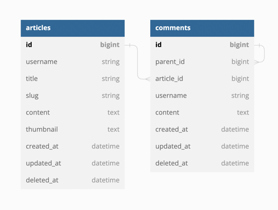

# Simple Article / Blog API Service
> The purpose of this project is for Jetdevs Technical Assessment

This project is for serving api for simple blog service with features : 
- Get List of Articles
- Get Detail of Article
- Post an Article
- Comment on Article
- Comment on a Comment

For more API documentation visit [here](./docs/api.md)  
By default this service will running on port `8080`

## Quick Start
- Create empty database on your DBMS
- Change database credentials on files below
  - `Makefile:2`
  - `config/local.yaml:7`
- Run `make start`

## Project Structure
In this project I use [Golang Standard Project Layout](https://github.com/golang-standards/project-layout) 
with several modification by removing some directory that I don't needed.
#### Project Structure
```
├── Makefile
├── README.md
├── cmd
│   └── http
├── config
├── docs
├── internal
│   ├── constant
│   ├── entity
│   ├── handler
│   ├── repository
│   └── usecase
├── pkg
└── tools
    └── migrations

```

## List of Used Package
### Production
- [Gofiber](https://gofiber.io/)
- [Gorm](https://gorm.io/)
- [Viper](https://github.com/spf13/viper)
- [Slug](github.com/gosimple/slug)

### Development
- [Logger](github.com/google/logger)
- [UUID](github.com/google/uuid)
- [Wire](github.com/google/wire)
- [Migrate](https://github.com/golang-migrate/migrate)
- [Lint](https://golangci-lint.run/)

## Database Diagram


## Usefull Commands
I use makefile to run several command that needed to run this project

#### Run HTTP
```
make http
```

#### Migrate Databases
```
make migrate
```

#### Generate Dependency Injection
```
make wire-gen
```

#### Run linter
```
make lint
```

#### Run coverage
```
make cover
```